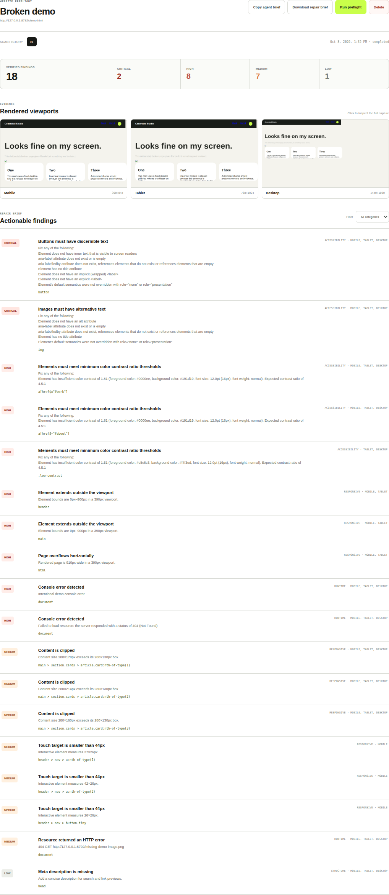
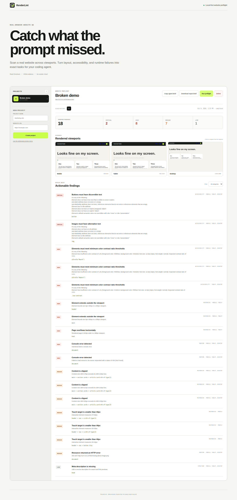

<p align="center">
  
</p>

<h1 align="center">RenderLint</h1>

Local-first preflight QA for AI-built websites.

> **Project status:** early MVP. The core single-page scan workflow works, but RenderLint is not a
> hardened public or multi-tenant service. See [Security](#security) and [Current limitations](#current-limitations).

RenderLint opens a real website in Chromium at mobile, tablet, and desktop sizes. It turns
responsive layout, accessibility, runtime, and network failures into a repair brief containing
exact DOM selectors and evidence for Codex, Claude Code, Cursor, or another coding agent.

## Current MVP

- Project-based scans with persistent SQLite history.
- Real Chromium rendering through Playwright.
- Full-page evidence at `390px`, `768px`, and `1440px`.
- Horizontal overflow, off-screen element, clipping, and touch-target checks.
- Accessibility checks powered by axe-core.
- Console error, page error, failed request, and HTTP error capture.
- H1 and meta-description structure checks.
- Severity and category filters.
- Agent-ready repair briefs that can be copied or downloaded as Markdown.
- A deliberately broken local demo for validating the scanner.
- No hosted service, account, analytics, or LLM API required.

## See it in action

Create a project, run a preflight, and inspect the same page at mobile, tablet, and desktop sizes.
The report groups verified findings by severity and includes DOM selectors for the affected elements.



<details>
  <summary>View the complete dashboard</summary>

  
</details>

## Start

```bash
docker compose up -d --build
```

Open [http://localhost:8787](http://localhost:8787), select **Use the deliberately broken demo**,
create the project, and run its first preflight.

To scan a development server running on the host machine from inside Docker, use
`http://host.docker.internal:PORT` instead of `http://localhost:PORT`.

## Stop

```bash
docker compose down
```

Projects, reports, and screenshots remain in the `renderlint-data` Docker volume. Add `-v` only
when you intentionally want to delete that data.

## Tests

Install development dependencies, then run the unit and browser suites:

```bash
npm ci
npx playwright install chromium
npm test
npm run test:browser
```

For a production-like end-to-end check, start the Docker service and run:

```bash
docker compose up -d --build --wait
npm run test:smoke
```

The smoke test creates and scans the broken demo, verifies responsive, accessibility, and runtime
findings, downloads screenshot evidence, checks the repair brief, and cleans up its project.

## Architecture

```text
Browser dashboard
      │
      ▼
Node.js API ───── SQLite report history
      │
      ▼
Playwright / Chromium
      ├── DOM layout measurements
      ├── axe-core accessibility
      ├── console and network capture
      └── viewport screenshots
```

RenderLint currently uses deterministic browser evidence. AI is treated as an output consumer,
not as the source of truth for whether a page is broken.

## Security

RenderLint is intentionally able to open URLs visible from its container, including internal
development services. Run it only on a trusted machine and do not expose port `8787` publicly.
Direct Node.js usage binds to `127.0.0.1` by default; Docker still publishes the configured port
on the host. Read [SECURITY.md](SECURITY.md) before any shared or remote deployment.

## Current limitations

- A project scans one URL; RenderLint does not crawl an entire website.
- Screenshots are full-page evidence, not annotated crops for individual findings.
- There are no visual-regression baselines or automatic before/after comparisons yet.
- Performance checks and Core Web Vitals are not included.
- Scan execution uses an in-process queue and is intended for a single trusted user.
- Authentication, tenant isolation, rate limiting, and private-network blocking are not included.

## Contributing

Issues and pull requests are welcome. Please read [CONTRIBUTING.md](CONTRIBUTING.md), follow the
[Code of Conduct](CODE_OF_CONDUCT.md), and report security problems according to
[SECURITY.md](SECURITY.md). RenderLint is available under the [MIT License](LICENSE).

## Planned next steps

- Screenshot regions linked directly to each finding.
- Before/after verification and visual regression baselines.
- Broken-link crawling beyond resources loaded by the current page.
- Lighthouse performance and SEO results.
- Optional design-token drift and visual-consistency suggestions.
